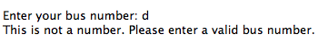

BusTracker
============

by Muhammad Amrullah and Felicia Tan

BusTracker automatically extracts real-time data of bus arrival timings (at respective bus stops) and presents it in the form od a digital interface.

Current data extraction technology and digital visualisation methods target static data rather than dynamic data. This means that data can only be processed and analysed post-collection. BusTracker however, ensures updatedness. It automatically extracts data from mytransport.sg, an open data portal on the internet to find the locations of specific buses.

The interface is easily adjustable - whether through editing code or editing static images - for effective and user-interactive visualisation.

Instructions
------------

Should have stable and continuous access to an internet-connected wireless network, and be allowed to run continuously.

Architecture
------------

Extracts API of bus arrival time data every 10s

Installation
------------
- requires Python >=2.7

- requires httplib2 (external library)
    1. Download httplib2 from https://pypi.python.org/pypi/httplib2#downloads
    2. Use Terminal for installation

    $ cd httplib2-0.9.1 $ python setup.py install

- run BusTracker.py

    $ python BusTracker.py

Examples of use
------------

- Input bus stop ID as per prompted

- Input bus number(s) as per prompted

    - you will be asked for more bus numbers until you input '0', which means that you do not wish to track any more bus services

    - if you input any non-integer, you will be prompted to enter a valid bus number

    
    - if you input a bus number that does not go to that bus stop, you will be prompted to enter a bus service that is available

    - if you input the same bus number again, you will be prompted to enter another bus number

- Bus arrival timings will be shown on a 'radar' interface, with the bus icon representing the next bus and the icon's distance from centre representing the duration before next arrival.

Copyright (c) 2015 Muhammad Amrullah and Felicia Tan

